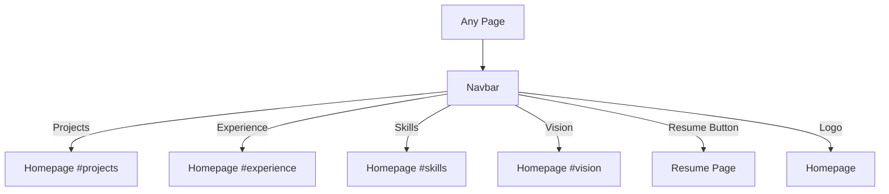

# PRD: Portfolio Website Redesign — Professional Blue/White Theme

**Author:** Juan Almeida
**Status:** Draft
**Last Updated:** 2026-03-09
**PRD Confidence Score:** 4/10

---

## 1. Executive Summary

We are redesigning juanelojga.com from its current green-on-black hacker theme to a clean, professional blue/white design system that positions Juan Almeida as a senior AI Systems Architect. The redesign introduces three new page types (Homepage, Case Study, Resume), shifts the visual language to a light background with blue (`#137fec`) accents, and adds new content sections (Philosophy, Vision, Timeline, Resume download with lead capture). Success looks like a modern, recruiter-friendly portfolio that communicates technical depth through structured case studies and a polished professional presence.

---

## 2. Problem Statement & Why Now

**The Problem:**
The current hacker-themed portfolio (green-on-black, Matrix rain effect, neon glow) served its purpose as a creative developer showcase, but does not align with the professional positioning expected of a Senior AI Solutions Architect targeting enterprise clients and hiring managers. The dark theme with scroll-snap navigation creates a distinctive experience but may limit perceived professionalism and readability for non-technical audiences (recruiters, CTOs, product leaders).

**Why Now:**

- Career positioning shift toward AI Systems Architecture and enterprise-facing roles demands a more polished, credible visual identity
- The current site lacks case study depth — projects are displayed as cards without narrative, technical detail, or measurable outcomes
- No resume/CV page exists, which is a critical asset for professional engagement
- The codebase is already on Astro 5 with a planned React migration — redesigning now lets us architect components correctly from the start

**Who Has This Problem:**
Primary audience: hiring managers, recruiters, and potential enterprise clients evaluating Juan's technical capabilities. Secondary: peer engineers and collaborators exploring his work.

`[NEEDS INPUT — Source: Complete user research (pm-research) to validate audience assumptions with analytics data from current site traffic]`

---

## 3. Goals & Success Metrics

**Primary Goal:**
Establish a professional digital presence that effectively communicates AI engineering expertise through structured content (case studies, skills taxonomy, resume) in a clean, accessible design.

**OKRs / KPIs:**

| Metric                                  | Baseline               | Target          | Timeline            |
| --------------------------------------- | ---------------------- | --------------- | ------------------- |
| Average session duration                | `[NEEDS INPUT]`        | +40% vs current | 60 days post-launch |
| Case study page views per visit         | 0 (page doesn't exist) | 1.2 avg         | 60 days post-launch |
| Resume download conversion rate         | 0 (no resume page)     | 5% of visitors  | 90 days post-launch |
| Lighthouse Performance score            | `[NEEDS INPUT]`        | >= 95           | At launch           |
| Lighthouse Accessibility score          | `[NEEDS INPUT]`        | >= 95           | At launch           |
| Contact form / email click-through rate | `[NEEDS INPUT]`        | +25% vs current | 60 days post-launch |

**Counter-metrics (what we won't sacrifice):**

- Page load time must not exceed 2s on 3G connections (current Astro SSG perf must be maintained)
- SEO rankings must not drop — all existing URLs must redirect properly
- i18n support (en/es) must be preserved across all new pages
- Google Analytics tracking continuity must not break

---

## 4. User Research & Key Insights

`[NEEDS INPUT — Source: Complete pm-research to fill this section with actual user data, heatmaps from current site, and stakeholder interviews]`

**Inferred Insights from Redesign Direction:**

**Insight 1:** Professional audiences prioritize readability and structured content over visual novelty.

- Supporting evidence: `[NEEDS INPUT — validate with analytics on bounce rate by referrer type]`
- Product implication: Light background, clean typography (Inter font family), generous whitespace, structured card layouts

**Insight 2:** Case studies with measurable outcomes are more persuasive than project thumbnails with tech tags.

- Supporting evidence: `[NEEDS INPUT — validate with A/B testing or industry benchmarks]`
- Product implication: Dedicated case study pages with Challenge → Solution → Implementation → Results narrative structure

**Insight 3:** Resume download with lead capture creates a networking pipeline.

- Supporting evidence: `[NEEDS INPUT — validate with comparable portfolio conversion benchmarks]`
- Product implication: Gated PDF download requiring name, email, company/role before accessing full resume

**What We Explicitly Chose Not to Do (based on design direction):**

- Keep the dark/hacker theme — does not align with enterprise-facing positioning
- Keep scroll-snap navigation — standard scroll provides better UX across devices and content types
- Keep Matrix rain animation — novelty effect doesn't serve professional perception
- Add a blog/writing section — content strategy not yet defined, deferred to future phase

---

## 5. Proposed Solution

**Summary:**
A complete visual redesign from green-on-black hacker theme to a professional light-mode portfolio using a blue (`#137fec`) accent color system on light gray (`#f6f7f8`) and white backgrounds. The site expands from a single-page layout to a multi-page architecture with three distinct page types: Homepage (hero + philosophy + vision + projects + skills/experience), Case Study (per-project deep dive), and Resume (PDF preview + lead capture form). The design uses Inter as the primary font, Material Symbols for icons, and a card-based component system with subtle hover interactions.

**Why This Approach:**
The mockups demonstrate a proven portfolio pattern used by senior technical professionals — structured, content-rich, recruiter-optimized. The blue accent color communicates trust and professionalism. The multi-page architecture allows deeper content engagement without overwhelming a single scroll.

**Engineering Rules (apply to all phases):**

1. **TypeScript mandatory** — All components, utilities, and scripts must be written in TypeScript. No `.js`/`.jsx` files; only `.ts`, `.tsx`, and `.astro`.
2. **One component per file** — Each component lives in its own file. No multi-component files.
3. **Unit test for every component** — Every `.astro` and `.tsx` component must have an accompanying `.test.ts`/`.test.tsx` file using Vitest. Astro components tested via `@testing-library/dom` or container rendering; React components tested via `@testing-library/react`.
4. **React only for interactivity** — Use `.tsx` React components only when the component requires client-side user interaction (forms, toggles, dynamic state). All static/presentational components must be `.astro` files.
5. **Mobile-first responsive** — All components must be built mobile-first and fully functional at 320px. Desktop layouts are progressive enhancements via `md:` and `lg:` breakpoints.
6. **SEO + AI scraping ready** — Every page must have complete meta tags, structured data (JSON-LD), semantic HTML, and machine-readable content. The site must be fully indexable by search engines and parseable by AI agents, LLM crawlers, and any automated client.

**What We're Not Building (v1):**

- Dark mode toggle (deferred indefinitely — remove all `dark:` utility classes from mockups during implementation)
- Blog or writing section
- Interactive project demos or live previews
- Client testimonials or social proof section
- Contact form with backend (keeping email link + social links for now)
- Search functionality
- CMS integration (content remains in JSON files)

---

## 6. Detailed Requirements

### 6.1 Design System Requirements

| #   | Requirement                                                                                                                                    | Priority    | Notes                                    |
| --- | ---------------------------------------------------------------------------------------------------------------------------------------------- | ----------- | ---------------------------------------- |
| DS1 | Replace color system: `bg-black` → `bg-background-light (#f6f7f8)`, `text-green-400` → `text-primary (#137fec)`, `bg-green-500` → `bg-primary` | Must Have   | Complete theme overhaul                  |
| DS2 | Adopt Inter font family (300-900 weights) as primary typeface                                                                                  | Must Have   | Replace current system fonts             |
| DS3 | Define border-radius tokens: DEFAULT=0.25rem, lg=0.5rem, xl=0.75rem, full=9999px                                                               | Must Have   | Consistent rounding                      |
| DS4 | Replace Font Awesome icons with Material Symbols Outlined                                                                                      | Should Have | Unified icon system                      |
| DS5 | Remove all green glow shadows (`shadow-[0_0_15px_#00FF80]`) and replace with subtle `shadow-primary/20`                                        | Must Have   |                                          |
| DS6 | Establish card component system: white bg, `border-slate-200`, `rounded-2xl`, hover `shadow-2xl` + `translate-y-[-1px]`                        | Must Have   | Used across projects, philosophy, skills |
| DS7 | Add gradient glow effect for hero image: `bg-gradient-to-r from-primary to-blue-400 rounded-xl blur opacity-25`                                | Should Have | Subtle visual interest                   |
| DS8 | Define section spacing: `py-20 px-6 md:px-20 lg:px-40` for major sections                                                                      | Must Have   | Consistent rhythm                        |

### 6.2 Navigation & Layout Requirements

| #   | Requirement                                                                                                  | Priority  | Notes                                             |
| --- | ------------------------------------------------------------------------------------------------------------ | --------- | ------------------------------------------------- |
| NV1 | Redesign navbar: white/80 backdrop-blur-md sticky header with logo (primary-colored icon + "Portfolio" text) | Must Have | Replace dark navbar                               |
| NV2 | Navbar links: Projects, Experience, Skills, Vision (homepage anchors)                                        | Must Have | Updated section names                             |
| NV3 | Add "Resume" CTA button in navbar (primary bg, white text, rounded-lg)                                       | Must Have | Direct path to resume page                        |
| NV4 | Remove scroll-snap behavior entirely                                                                         | Must Have | Standard scroll for all devices                   |
| NV5 | Remove IntersectionObserver section activation logic                                                         | Must Have | Simplify JS                                       |
| NV6 | Preserve mobile hamburger menu with updated styling                                                          | Must Have | Responsive nav                                    |
| NV7 | Add breadcrumb navigation on Case Study and Resume pages                                                     | Must Have | Required for SEO `BreadcrumbList` structured data |
| NV8 | Redesign footer: `bg-slate-50`, border-top, logo + social links (LinkedIn, GitHub, Twitter) + copyright      | Must Have | Replace dark footer                               |

### 6.7 SEO & AI Readiness Requirements

| #     | Requirement                                                                                                                                                      | Priority    | Notes                                                             |
| ----- | ---------------------------------------------------------------------------------------------------------------------------------------------------------------- | ----------- | ----------------------------------------------------------------- |
| SEO1  | Full meta tag set on every page (title, description, canonical, robots, author, hreflang)                                                                        | Must Have   | See Section 8.7.2 for complete list                               |
| SEO2  | Open Graph + Twitter Card meta on every page                                                                                                                     | Must Have   | See Section 8.7.3                                                 |
| SEO3  | JSON-LD structured data per page type: `Person`+`WebSite`+`ProfilePage` (home), `TechArticle`+`BreadcrumbList` (case study), `WebPage`+`BreadcrumbList` (resume) | Must Have   | See Section 8.7.4                                                 |
| SEO4  | Semantic HTML landmarks on every page: `<header>`, `<nav>`, `<main>`, `<section>`, `<article>`, `<footer>`, proper heading hierarchy (h1-h6, no skips)           | Must Have   | See Section 8.7.1                                                 |
| SEO5  | Descriptive `alt` text on all images                                                                                                                             | Must Have   | No empty alts except decorative images with `role="presentation"` |
| SEO6  | `<time datetime="...">` on all dates (experience timeline, case study metadata)                                                                                  | Must Have   | Machine-readable dates                                            |
| SEO7  | `hreflang` alternate links (en, es, x-default) on every page                                                                                                     | Must Have   | i18n SEO                                                          |
| SEO8  | Clean URL slugs for case studies: `/en/projects/ai-agent-orchestrator`                                                                                           | Must Have   | Descriptive, keyword-rich URLs                                    |
| SEO9  | XML sitemap with hreflang via `@astrojs/sitemap`                                                                                                                 | Must Have   | Already configured                                                |
| SEO10 | `robots.txt` explicitly allowing all AI crawlers (GPTBot, ClaudeBot, PerplexityBot, etc.)                                                                        | Must Have   | See Section 8.8.1                                                 |
| SEO11 | `/llms.txt` file with structured site/owner overview for AI discovery                                                                                            | Must Have   | See Section 8.8.3                                                 |
| SEO12 | `/llms-full.txt` auto-generated at build time with full plain-text site content                                                                                  | Should Have | See Section 8.8.4                                                 |
| SEO13 | All content in DOM HTML (no canvas text, no JS-gated content, no text-as-image)                                                                                  | Must Have   | Astro SSG guarantees this                                         |
| SEO14 | Microdata (`itemscope`/`itemprop`) on project cards, skill lists, experience entries                                                                             | Should Have | See Section 8.8.5                                                 |
| SEO15 | OG image per page (1200x630px, unique per case study)                                                                                                            | Should Have | Social sharing optimization                                       |
| SEO16 | HTTP `X-Robots-Tag: index, follow` header on all pages                                                                                                           | Must Have   | See Section 8.8.6                                                 |

### 6.3 Homepage Requirements

| #    | Requirement                                                                                                                                    | Priority    | Notes                                                  |
| ---- | ---------------------------------------------------------------------------------------------------------------------------------------------- | ----------- | ------------------------------------------------------ |
| HP1  | Hero section: two-column layout — left (subtitle tag + h1 headline + description + 2 CTAs), right (personal portrait photo with gradient glow) | Must Have   | Replace Matrix rain hero; keep personal photo approach |
| HP2  | Hero subtitle tag: "AI SYSTEMS ARCHITECT" in primary color, uppercase, tracking-widest                                                         | Must Have   | Professional positioning                               |
| HP3  | Hero headline: "Designing the Future of AI" — text-5xl md:text-6xl font-black                                                                  | Must Have   | Bold, impactful                                        |
| HP4  | Hero CTAs: "Get in Touch" (primary solid, anchors to #contact) + "View Projects" (white bordered, anchors to #projects)                        | Must Have   | Dual action paths                                      |
| HP5  | Philosophy & Outlook section: 3-card grid with icon + title + description                                                                      | Must Have   | Self-Learner, Curiosity, Responsible Dev               |
| HP6  | Section headers with blue underline accent: `h-1 w-20 bg-primary rounded-full`                                                                 | Must Have   | Visual consistency                                     |
| HP7  | Vision & Future section: centered layout, 3 stacked cards with icon + title + long description                                                 | Must Have   | My Vision, My Expectations, Future Focus               |
| HP8  | Featured Projects section: 3-card grid with image (aspect-video, hover scale), tech tags, title, description, "View Case Study" link           | Must Have   | Links to case study pages                              |
| HP9  | Technical Proficiency section: 2x2 grid (Frameworks, Languages, Deployment, Specialization) with categorized skill lists                       | Must Have   | Replace tabbed skills interface                        |
| HP10 | Recent Work timeline: left-bordered timeline with colored dots, role title, date range, description                                            | Must Have   | Replace tabbed experience interface                    |
| HP11 | Technical Proficiency + Recent Work displayed side-by-side in 2-column grid on desktop                                                         | Should Have | Efficient layout                                       |

### 6.4 Case Study Page Requirements

| #    | Requirement                                                                                                                                                  | Priority    | Notes                      |
| ---- | ------------------------------------------------------------------------------------------------------------------------------------------------------------ | ----------- | -------------------------- |
| CS1  | Create new page template: `/[lang]/projects/[slug].astro`                                                                                                    | Must Have   | Dynamic routes per project |
| CS2  | Case Study hero: two-column — left (category tag + h1 + description + 2 CTAs: "View Live Demo" + "Read Github Docs"), right (full-width image)               | Must Have   |                            |
| CS3  | Project metadata bar: Role, Duration, Tech Stack, Target — 4-column grid with labeled values                                                                 | Must Have   | Quick-reference stats      |
| CS4  | "The Challenge" section: icon + heading + multi-paragraph narrative                                                                                          | Must Have   | Problem framing            |
| CS5  | "The Solution" section: icon + heading + narrative + 2-column feature cards (e.g., Dynamic Decomposition, Shared Memory Space)                               | Must Have   | Solution explanation       |
| CS6  | "Technical Implementation" section: tech stack pills (colored dots + labels), code snippet display (dark bg with syntax coloring, traffic-light header dots) | Must Have   | Technical credibility      |
| CS7  | "The Results" section: 3-column metrics grid (large number + label) + narrative paragraph                                                                    | Must Have   | Measurable outcomes        |
| CS8  | Footer CTA section: centered "Have a similar project in mind?" with "Get in Touch" + "Back to Portfolio" buttons                                             | Should Have | Conversion opportunity     |
| CS9  | Share and Bookmark buttons in Case Study navbar                                                                                                              | Could Have  | Social sharing             |
| CS10 | Tech stack pills with colored dots: blue (Python), emerald (LangChain), orange (Pinecone), purple (Redis), cyan (Docker)                                     | Should Have | Visual differentiation     |

### 6.5 Resume Page Requirements

| #    | Requirement                                                                                                                                      | Priority    | Notes                                  |
| ---- | ------------------------------------------------------------------------------------------------------------------------------------------------ | ----------- | -------------------------------------- |
| RS1  | Create new page: `/[lang]/resume.astro`                                                                                                          | Must Have   | New route                              |
| RS2  | Page header: "Professional Resume" h1 + subtitle describing experience overview                                                                  | Must Have   |                                        |
| RS3  | Resume PDF preview: mock document display with macOS-style window chrome (traffic-light dots + filename header), gradient fade overlay at bottom | Must Have   | Visual teaser                          |
| RS4  | Lead capture form: Full Name + Email Address fields + "Download Resume (PDF)" primary CTA button                                                 | Must Have   | Gated download (no Company/Role field) |
| RS5  | Form privacy notice: "Your information is used solely for professional networking purposes."                                                     | Must Have   | Trust signal                           |
| RS6  | Skills quick-links: 4-column grid (Development, UI/UX Design, Cloud Systems, Leadership) with icons and sub-labels                               | Should Have | Competency overview                    |
| RS7  | Form submission via Netlify Forms (`data-netlify="true"`)                                                                                        | Must Have   | Zero-config, built-in spam filtering   |
| RS8  | reCAPTCHA integration on lead capture form                                                                                                       | Must Have   | Spam protection for form submissions   |
| RS9  | Actual PDF resume file to serve on download                                                                                                      | Must Have   | PDF is ready for integration           |
| RS10 | Breadcrumb: Home > Resume                                                                                                                        | Should Have | Navigation context                     |

### 6.6 Non-Functional Requirements

| #    | Requirement         | Target                                                                                                                          |
| ---- | ------------------- | ------------------------------------------------------------------------------------------------------------------------------- |
| NF1  | Performance         | Lighthouse >= 95, FCP < 1.5s, LCP < 2.5s                                                                                        |
| NF2  | Accessibility       | WCAG 2.1 AA compliance, Lighthouse >= 95                                                                                        |
| NF3  | SEO                 | Lighthouse SEO >= 100; full structured data on every page; see Section 8.7 for complete requirements                            |
| NF3a | AI / Bot readiness  | Site must be fully scrapeable by LLM crawlers (GPTBot, ClaudeBot, etc.), search bots, and any automated client; see Section 8.9 |
| NF4  | Responsive          | Mobile-first design; fully functional at 320px, tested at 320px, 768px, 1024px, 1440px breakpoints                              |
| NF5  | Browser support     | Last 2 versions of Chrome, Firefox, Safari, Edge                                                                                |
| NF6  | i18n                | All new pages and content must support en/es locales                                                                            |
| NF7  | Image optimization  | All images via `astro:assets` Image component with explicit dimensions                                                          |
| NF8  | Bundle size         | No new runtime JS frameworks beyond React (when added)                                                                          |
| NF9  | TypeScript          | All code must be TypeScript — no `.js`/`.jsx` files allowed                                                                     |
| NF10 | Testing             | Every component must have an accompanying unit test file (`*.test.ts` / `*.test.tsx`)                                           |
| NF11 | Component isolation | One component per file — no multi-component files                                                                               |
| NF12 | React boundary      | React (`.tsx`) only for components with client-side user interaction; everything else is `.astro`                               |

---

## 7. User Flows & Wireframes

### 7.1 Homepage Flow (Happy Path)

```mermaid
flowchart TD
    A[User lands on /en/] --> B[Hero Section]
    B --> C{User Action}
    C -->|"Get in Touch"| D[Scroll to Contact / Email]
    C -->|"View Projects"| E[Scroll to Featured Projects]
    C -->|Scroll down| F[Philosophy & Outlook]
    F --> G[Vision & Future]
    G --> E
    E --> H{Click "View Case Study"}
    H --> I[Case Study Page /en/projects/slug]
    E --> J[Technical Proficiency + Recent Work]
    J --> K[Footer]
```

### 7.2 Case Study Flow (Happy Path)

```mermaid
flowchart TD
    A[User clicks "View Case Study" from Homepage] --> B[Case Study Hero]
    B --> C[Project Metadata Bar]
    C --> D[The Challenge]
    D --> E[The Solution]
    E --> F[Technical Implementation + Code]
    F --> G[The Results / Metrics]
    G --> H{User Action}
    H -->|"Get in Touch"| I[Contact / Email]
    H -->|"Back to Portfolio"| J[Homepage]
    H -->|"View Live Demo"| K[External Project Link]
    H -->|"Read Github Docs"| L[External GitHub Link]
```

### 7.3 Resume Flow (Happy Path)

```mermaid
flowchart TD
    A[User clicks "Resume" in Navbar] --> B[Resume Page]
    B --> C[View PDF Preview - faded/teaser]
    C --> D[Lead Capture Form]
    D --> E[User fills: Name, Email, Company]
    E --> F[Click "Download Resume PDF"]
    F --> G{Form Valid?}
    G -->|Yes| H[Submit to Backend + Trigger PDF Download]
    G -->|No| I[Show Validation Errors]
    H --> J[Thank You State / PDF Opens]
```

### 7.4 Navigation Flow (Cross-Page)



### Wireframes

The following HTML mockup files serve as high-fidelity wireframes:

| Page       | Mockup File                                       | Screenshot              |
| ---------- | ------------------------------------------------- | ----------------------- |
| Homepage   | `/home/juanelojga/Downloads/stitch/code.html`     | `stitch/screen.png`     |
| Case Study | `/home/juanelojga/Downloads/stitch (1)/code.html` | `stitch (1)/screen.png` |
| Resume     | `/home/juanelojga/Downloads/stitch (2)/code.html` | `stitch (2)/screen.png` |

---

## 8. Technical Considerations

### 8.1 Architecture Changes

- **Page routing expansion:** Currently 2 pages (`index.astro`, `[lang]/index.astro`). Must add:
  - `src/pages/[lang]/resume.astro` — Resume page
  - `src/pages/[lang]/projects/[slug].astro` — Dynamic case study pages with `getStaticPaths()`
- **Content model expansion:** `src/content/projects.json` must be extended with case study fields: category, role, duration, techStack, target, challenge, solution, solutionFeatures, implementation (techPills, codeSnippet), results (metrics array + narrative), links (demo, github)
- **New components required:**
  - `Hero.astro` — Complete rewrite (remove Matrix rain canvas, new two-column layout)
  - `Philosophy.astro` — New section (3-card grid)
  - `Vision.astro` — New section (stacked cards)
  - `ProjectCard.astro` — Redesigned project card with image, tags, case study link
  - `CaseStudyHero.astro` — Case study page hero
  - `CaseStudySection.astro` — Reusable section with icon + heading + content
  - `MetricsGrid.astro` — Results metrics display
  - `CodeBlock.astro` — Styled code snippet with traffic-light chrome
  - `TechPills.astro` — Tech stack pill badges
  - `ResumePreview.astro` — PDF mockup display
  - `LeadCaptureForm.tsx` — React component (requires client-side interaction: form validation, submit state, reCAPTCHA)
  - `Breadcrumbs.astro` — Breadcrumb navigation
  - `Timeline.astro` — Experience timeline
  - `SkillGrid.astro` — Categorized skills display

### 8.2 Styling Migration

- **Tailwind config overhaul:** Add custom colors (`primary: #137fec`, `background-light: #f6f7f8`, `background-dark: #101922`), Inter font family, updated border-radius tokens
- **Remove:** All green-glow shadow utilities, Matrix animation keyframes, scroll-snap CSS from `global.css`
- **Add:** Card hover transitions, gradient glow effects, section heading underline accent pattern
- **Custom animations:** Replace `fade-in-left`, `fade-in-right`, `fadeInUp` with smoother, more subtle entrance animations appropriate for professional design

### 8.3 i18n Impact

- Both `en.json` and `es.json` need new keys for:
  - New navbar items (Resume CTA, updated link labels)
  - Case study page (all section headings, CTA text)
  - Resume page (header, form labels, CTA, privacy notice)
  - Footer (updated links, copyright text)
  - Breadcrumb labels
- Philosophy & Vision content: **English-only** — stored in content files, not i18n files (consistent with existing content pattern)
- Content files in `src/content/` remain English-only per existing pattern

### 8.4 React Integration Decision

**Rule: React only when there is client-side user interaction.** A component needs React if and only if it manages user-driven state (form input, toggles, dynamic filtering, etc.). All static/presentational components must be Astro.

**React components (`.tsx`):**

- `LeadCaptureForm.tsx` — form validation, submit state (loading/success/error), reCAPTCHA integration. Use `client:visible` for lazy hydration.

**Astro components (`.astro`) — everything else:**

- Hero, Philosophy, Vision, ProjectCard, CaseStudyHero, CaseStudySection, MetricsGrid, CodeBlock, TechPills, ResumePreview, Breadcrumbs, Timeline, SkillGrid, Navbar, Footer, Layout

- Requires adding `@astrojs/react` integration to `astro.config.mjs`

### 8.5 Dependencies & New Packages

| Package                  | Purpose                                      | Required?            |
| ------------------------ | -------------------------------------------- | -------------------- |
| `@astrojs/react`         | React integration for interactive components | Must Have (for form) |
| `react` + `react-dom`    | React runtime                                | Must Have            |
| `vitest`                 | Unit testing framework                       | Must Have            |
| `@testing-library/react` | React component testing (`.tsx` components)  | Must Have            |
| `@testing-library/dom`   | DOM testing for Astro component output       | Must Have            |
| `happy-dom` or `jsdom`   | DOM environment for Vitest                   | Must Have            |

### 8.6 Analytics / Tracking Requirements

- Preserve existing Google Analytics (GA4) via Partytown
- New events to instrument:
  - `page_view` on new pages (Case Study, Resume) — automatic with GA4
  - `case_study_view` — custom event with project slug
  - `resume_download_attempt` — form submission
  - `resume_download_success` — successful PDF delivery
  - `cta_click` — with label (Get in Touch, View Projects, View Live Demo, etc.)
  - `outbound_link` — GitHub, LinkedIn, Twitter clicks

### 8.7 SEO — Comprehensive Requirements

#### 8.7.1 Semantic HTML Structure

Every page must use proper semantic landmarks. No `<div>` soup — structure must be meaningful to parsers:

```
<header>     — Navbar (one per page)
<nav>        — Primary navigation, breadcrumbs (with aria-label to distinguish)
<main>       — Single main content area per page
<article>    — Case study content, standalone sections
<section>    — Each major content block (Hero, Philosophy, Vision, Projects, etc.)
<aside>      — Sidebar content if applicable
<footer>     — Site footer (one per page)
<h1>         — Exactly one per page, representing the page title
<h2>-<h6>    — Proper heading hierarchy, no skipped levels
<figure>     — Images with <figcaption> where descriptive context adds value
<time>       — All dates with datetime attribute (e.g., <time datetime="2023-01">2023 - Present</time>)
<address>    — Contact information
<dl/dt/dd>   — Skill categories, metadata key-value pairs
```

#### 8.7.2 Meta Tags (per page)

Every page must include the full set — no exceptions:

| Tag                                           | Required    | Notes                                                                                    |
| --------------------------------------------- | ----------- | ---------------------------------------------------------------------------------------- |
| `<title>`                                     | Must Have   | Unique per page, 50-60 chars, format: `Page Name — Juan Almeida \| AI Systems Architect` |
| `<meta name="description">`                   | Must Have   | Unique per page, 150-160 chars, includes primary keyword                                 |
| `<meta name="keywords">`                      | Should Have | 5-10 relevant terms per page                                                             |
| `<link rel="canonical">`                      | Must Have   | Absolute URL, self-referencing on each page                                              |
| `<meta name="robots">`                        | Must Have   | `index, follow` on all public pages                                                      |
| `<meta name="author">`                        | Must Have   | `Juan Almeida`                                                                           |
| `<html lang="en">` / `<html lang="es">`       | Must Have   | Correct language per locale                                                              |
| `<link rel="alternate" hreflang="en">`        | Must Have   | Points to English version                                                                |
| `<link rel="alternate" hreflang="es">`        | Must Have   | Points to Spanish version                                                                |
| `<link rel="alternate" hreflang="x-default">` | Must Have   | Points to `/en/` as default                                                              |

#### 8.7.3 Open Graph & Social Meta

Every page must include:

```html
<meta property="og:title" content="..." />
<meta property="og:description" content="..." />
<meta property="og:image" content="..." />
<!-- absolute URL, 1200x630px -->
<meta property="og:image:width" content="1200" />
<meta property="og:image:height" content="630" />
<meta property="og:image:alt" content="..." />
<meta property="og:url" content="..." />
<!-- canonical URL -->
<meta property="og:type" content="website|article" />
<meta property="og:locale" content="en_US|es_ES" />
<meta property="og:locale:alternate" content="..." />
<meta property="og:site_name" content="Juan Almeida — AI Systems Architect" />

<meta name="twitter:card" content="summary_large_image" />
<meta name="twitter:title" content="..." />
<meta name="twitter:description" content="..." />
<meta name="twitter:image" content="..." />
<meta name="twitter:image:alt" content="..." />
```

Case study pages should use `og:type="article"` with additional:

```html
<meta property="article:author" content="Juan Almeida" />
<meta property="article:published_time" content="..." />
<meta property="article:tag" content="Python" />
<meta property="article:tag" content="LangChain" />
```

#### 8.7.4 JSON-LD Structured Data

Each page type requires specific schema markup. All JSON-LD must be in `<script type="application/ld+json">` in `<head>`.

**Homepage — `Person` + `WebSite` + `ProfilePage`:**

```json
[
  {
    "@context": "https://schema.org",
    "@type": "WebSite",
    "name": "Juan Almeida — AI Systems Architect",
    "url": "https://www.juanelojga.com",
    "inLanguage": ["en", "es"],
    "author": { "@id": "#person" }
  },
  {
    "@context": "https://schema.org",
    "@type": "ProfilePage",
    "mainEntity": {
      "@type": "Person",
      "@id": "#person",
      "name": "Juan Almeida",
      "jobTitle": "AI Systems Architect",
      "url": "https://www.juanelojga.com",
      "sameAs": ["https://github.com/juanelojga", "https://linkedin.com/in/juanelojga"],
      "knowsAbout": ["AI", "LLM Orchestration", "Full-Stack Engineering", "..."],
      "hasOccupation": {
        "@type": "Occupation",
        "name": "AI Systems Architect",
        "occupationalCategory": "15-1252.00"
      }
    }
  }
]
```

**Case Study pages — `TechArticle` + `BreadcrumbList`:**

```json
[
  {
    "@context": "https://schema.org",
    "@type": "TechArticle",
    "headline": "AI Agent Orchestrator",
    "description": "...",
    "author": { "@id": "#person" },
    "datePublished": "2024-...",
    "image": "...",
    "keywords": ["Python", "LangChain", "AI Agents"],
    "proficiencyLevel": "Expert",
    "dependencies": "Python 3.11, LangChain, Pinecone"
  },
  {
    "@context": "https://schema.org",
    "@type": "BreadcrumbList",
    "itemListElement": [
      {
        "@type": "ListItem",
        "position": 1,
        "name": "Home",
        "item": "https://www.juanelojga.com/en/"
      },
      {
        "@type": "ListItem",
        "position": 2,
        "name": "Projects",
        "item": "https://www.juanelojga.com/en/#projects"
      },
      { "@type": "ListItem", "position": 3, "name": "AI Agent Orchestrator" }
    ]
  }
]
```

**Resume page — `WebPage` + `BreadcrumbList`:**

```json
{
  "@context": "https://schema.org",
  "@type": "WebPage",
  "name": "Professional Resume — Juan Almeida",
  "description": "...",
  "mainEntity": { "@id": "#person" },
  "breadcrumb": { "@type": "BreadcrumbList", "..." }
}
```

#### 8.7.5 Technical SEO

| Requirement      | Implementation                                                                                                 |
| ---------------- | -------------------------------------------------------------------------------------------------------------- |
| XML Sitemap      | Auto-generated by `@astrojs/sitemap`; must include all pages with correct `hreflang` alternates                |
| `robots.txt`     | Allow all crawlers; reference sitemap URL; allow AI bots explicitly                                            |
| Canonical URLs   | Self-referencing on every page; absolute URLs with `https://www.juanelojga.com`                                |
| 301 Redirects    | `/` → `/en/` (existing); add redirects for any changed URLs                                                    |
| Page speed       | FCP < 1.5s, LCP < 2.5s, CLS < 0.1, INP < 200ms                                                                 |
| Mobile usability | Pass Google Mobile-Friendly test on all pages                                                                  |
| HTTPS            | Enforced via Netlify (already in place)                                                                        |
| `hreflang` tags  | On every page: `en`, `es`, `x-default` pointing to `/en/`                                                      |
| Image SEO        | All `` must have descriptive `alt` text; use `loading="lazy"` below fold, `loading="eager"` for LCP image |
| Internal linking | Every page reachable within 2 clicks from homepage                                                             |
| URL structure    | Clean, descriptive slugs: `/en/projects/ai-agent-orchestrator` not `/en/projects/1`                            |

#### 8.7.6 Content SEO Checklist (per page)

- [ ] Unique `<title>` tag (50-60 chars)
- [ ] Unique `<meta description>` (150-160 chars)
- [ ] Exactly one `<h1>` per page
- [ ] Heading hierarchy: h1 → h2 → h3 (no skips)
- [ ] All images have descriptive `alt` text
- [ ] All links have descriptive anchor text (no "click here")
- [ ] Internal links to related pages/sections
- [ ] External links have `rel="noopener noreferrer"` on `target="_blank"`
- [ ] Dates use `<time datetime="...">` element
- [ ] All text is in the DOM (not rendered via JS/canvas)

### 8.8 AI & Bot Scraping Readiness

The site must be optimized for consumption by AI agents (ChatGPT, Claude, Perplexity, etc.), search engine crawlers, and any automated HTTP client. The goal is to make Juan Almeida's professional information maximally discoverable and accurately extractable by machines.

#### 8.8.1 Crawler Access Policy

**`robots.txt`** — Explicitly allow all known AI crawlers:

```
User-agent: *
Allow: /

User-agent: GPTBot
Allow: /

User-agent: ChatGPT-User
Allow: /

User-agent: ClaudeBot
Allow: /

User-agent: Claude-Web
Allow: /

User-agent: PerplexityBot
Allow: /

User-agent: Bytespider
Allow: /

User-agent: CCBot
Allow: /

User-agent: anthropic-ai
Allow: /

User-agent: Googlebot
Allow: /

User-agent: Bingbot
Allow: /

Sitemap: https://www.juanelojga.com/sitemap-index.xml
```

#### 8.8.2 Machine-Readable Content Architecture

All meaningful content must be in the HTML DOM, not behind JS rendering, canvas elements, or images-of-text:

| Principle                     | Implementation                                                                               |
| ----------------------------- | -------------------------------------------------------------------------------------------- |
| No content in `<canvas>`      | Remove Matrix rain; all text in semantic HTML                                                |
| No text-as-image              | Skills, titles, descriptions are real text — never rendered as SVG/PNG text                  |
| No JS-gated content           | All content visible in initial HTML (Astro SSG guarantees this)                              |
| Clean text extraction         | Any `curl` or `fetch` of a page URL returns complete content in the HTML response            |
| Structured content over prose | Use lists, tables, definition lists, and labeled sections so bots can extract key-value data |

#### 8.8.3 `llms.txt` — AI Discovery File

Add a `/llms.txt` file at the site root (inspired by the emerging `llms.txt` convention) to provide AI systems with a structured overview of the site and its owner:

```markdown
# Juan Almeida — AI Systems Architect

> Full-stack engineer and AI specialist building intelligent systems with LLM orchestration and scalable engineering.

## About

- Name: Juan Almeida
- Title: AI Systems Architect
- Location: [city/country]
- Website: https://www.juanelojga.com
- GitHub: https://github.com/juanelojga
- LinkedIn: https://linkedin.com/in/juanelojga
- Email: [professional email]

## Key Skills

- LLM Orchestration, AI Agents, RAG Pipelines
- Python, TypeScript, Rust
- LangChain, PyTorch, TensorFlow
- Docker, Kubernetes, AWS
- Full-Stack Engineering, Scalable Systems

## Pages

- Home: https://www.juanelojga.com/en/
- Projects: https://www.juanelojga.com/en/#projects
- Resume: https://www.juanelojga.com/en/resume
- Case Study — AI Agent Orchestrator: https://www.juanelojga.com/en/projects/ai-agent-orchestrator
- Case Study — Scalable RAG Pipeline: https://www.juanelojga.com/en/projects/scalable-rag-pipeline
- Case Study — Autonomous DevOps: https://www.juanelojga.com/en/projects/autonomous-devops
```

#### 8.8.4 `llms-full.txt` — Complete Content for AI Consumption

Add a `/llms-full.txt` file that contains the full plain-text content of the entire site, structured for LLM ingestion. This allows AI systems to understand the complete portfolio in a single fetch:

```markdown
# Juan Almeida — Full Portfolio Content

## Homepage

### Hero

AI Systems Architect
Designing the Future of AI
A self-learner driven by curiosity, specializing in LLM orchestration...

### Philosophy & Outlook

[full text of all 3 philosophy cards]

### Vision & Future

[full text of all 3 vision items]

### Featured Projects

[title + description + tags for each project]

### Technical Proficiency

[all skill categories and items]

### Recent Work

[all timeline entries with dates, roles, descriptions]

## Case Study: AI Agent Orchestrator

[complete case study content: challenge, solution, implementation, results]

## Case Study: Scalable RAG Pipeline

[complete case study content]

## Case Study: Autonomous DevOps

[complete case study content]

## Resume

[professional summary, key competencies]
```

This file should be auto-generated at build time from the content JSON files and page content.

#### 8.8.5 Semantic Markup for AI Extraction

Use `data-*` attributes and microdata patterns that help scrapers identify content purpose:

```html
<!-- Skill items should be in structured lists -->
<dl>
  <dt>Frameworks</dt>
  <dd>PyTorch</dd>
  <dd>LangChain</dd>
  <dd>TensorFlow</dd>
</dl>

<!-- Project cards should use article + schema -->
<article itemscope itemtype="https://schema.org/CreativeWork">
  <h3 itemprop="name">AI Agent Orchestrator</h3>
  <p itemprop="description">A framework for managing multi-agent swarms...</p>
  <span itemprop="keywords">Python, LangChain</span>
</article>

<!-- Experience entries use structured time -->
<div itemscope itemtype="https://schema.org/OrganizationRole">
  <time itemprop="startDate" datetime="2023-01">2023</time> -
  <time itemprop="endDate">Present</time>
  <span itemprop="roleName">Senior AI Solutions Architect</span>
</div>
```

#### 8.8.6 HTTP Headers for Bot Friendliness

Configure in `netlify.toml`:

```toml
[[headers]]
  for = "/*"
  [headers.values]
    X-Robots-Tag = "index, follow"
    X-Content-Type-Options = "nosniff"

[[headers]]
  for = "/llms.txt"
  [headers.values]
    Content-Type = "text/plain; charset=utf-8"
    Cache-Control = "public, max-age=86400"

[[headers]]
  for = "/llms-full.txt"
  [headers.values]
    Content-Type = "text/plain; charset=utf-8"
    Cache-Control = "public, max-age=86400"
```

#### 8.8.7 Structured Data Testing Requirements

Before launch, validate all structured data:

- [ ] Google Rich Results Test — passes for all page types
- [ ] Schema.org Validator — no errors on JSON-LD
- [ ] Test `curl -s https://www.juanelojga.com/en/ | grep -c "application/ld+json"` returns expected count
- [ ] Test `/llms.txt` is accessible and returns 200
- [ ] Test `/llms-full.txt` is accessible and returns complete content
- [ ] Test `/robots.txt` allows all target crawlers
- [ ] Test `/sitemap-index.xml` includes all pages with hreflang
- [ ] Validate `hreflang` tags match across en/es page pairs

### 8.9 Form Backend

**Decision: Netlify Forms** — Zero config, already on Netlify hosting. Add `data-netlify="true"` to the form element. Free tier provides 100 submissions/month with built-in spam filtering.

Additional requirements:

- Add `data-netlify-recaptcha="true"` for reCAPTCHA integration
- Form fields: Name (text, required), Email (email, required) — no Company/Role field
- Honeypot field (`netlify-honeypot`) for bot detection layer
- Success/error states handled client-side (React component)

---

## 9. Launch Plan & Phasing

### Phase 1 — MVP (Target: 4-6 weeks)

**Scope:**

- Set up Vitest + testing libraries (`@testing-library/react`, `@testing-library/dom`, `happy-dom`)
- Complete design system migration (colors, typography, spacing, cards)
- Navbar redesign with Resume CTA
- Homepage: Hero, Philosophy, Vision, Featured Projects (3 cards), Technical Proficiency + Recent Work
- Footer redesign
- Remove scroll-snap, Matrix rain, all dark-theme artifacts
- Update Tailwind config with new design tokens
- Update i18n files for all new content
- Mobile-first responsive across all breakpoints (320px, 768px, 1024px, 1440px)
- Semantic HTML structure on all components (proper landmarks, heading hierarchy, `<time>`, `<dl>`)
- Full meta tag set on homepage (title, description, canonical, hreflang, OG, Twitter)
- JSON-LD structured data for homepage (`Person` + `WebSite` + `ProfilePage`)
- `robots.txt` with explicit AI crawler allowances
- `/llms.txt` discovery file
- Unit tests for every component built in this phase

**Success gate:** Homepage renders correctly in en/es, Lighthouse >= 90 on all metrics (SEO = 100), all structured data validates, `robots.txt` and `llms.txt` accessible, all component tests passing.

### Phase 2 — Case Studies + Resume (Target: 3-4 weeks after Phase 1)

**Scope:**

- Case Study page template with full narrative structure
- At least 3 case studies with real content (AI Agent Orchestrator, RAG Pipeline, Autonomous DevOps)
- Resume page with PDF preview and lead capture form
- React integration (`@astrojs/react`) for form component
- Netlify Forms backend integration
- Breadcrumb navigation on sub-pages with `BreadcrumbList` JSON-LD
- `TechArticle` JSON-LD on each case study page
- `WebPage` JSON-LD on resume page
- OG images per case study (unique, 1200x630px)
- Microdata (`itemscope`/`itemprop`) on project cards, skill lists, experience entries
- Analytics event instrumentation for new pages
- `/llms-full.txt` auto-generated at build time with complete site content
- Unit tests for every component built in this phase

**Success gate:** All 3 page types functional in en/es, Lighthouse SEO = 100 on all pages, all JSON-LD validates via Google Rich Results Test, `llms-full.txt` auto-generates, form submissions working, all analytics events firing, all component tests passing.

### Phase 3 — Polish & QA (Target: 2-3 weeks after Phase 2)

**Scope:**

- Integration tests for i18n consistency across all pages
- Accessibility audit and fixes (WCAG 2.1 AA)
- Performance optimization (image formats, lazy loading, bundle analysis)
- Cross-browser testing (Chrome, Firefox, Safari, Edge)
- Mobile device testing (real devices or BrowserStack)
- Test coverage review — ensure all components have tests
- Full SEO audit: validate all structured data, hreflang pairs, sitemap, robots.txt
- AI scraping validation: test content extraction via `curl`, verify `llms.txt` and `llms-full.txt`
- Submit sitemap to Google Search Console and Bing Webmaster Tools

**Success gate:** All tests passing, Lighthouse >= 95 on all metrics (SEO = 100), WCAG 2.1 AA compliant, all structured data validates, AI discovery files verified.

### Future Consideration (unscheduled)

- Blog / writing section
- Animated page transitions (Astro View Transitions refinement)
- Interactive project demos
- Client testimonials / social proof
- CMS integration (Astro Content Collections with schema validation)
- Contact form with backend (beyond email link)

### Rollout Strategy

- [x] Feature branch development (`feat/new-design` — already created)
- [ ] Netlify Deploy Previews for stakeholder review at each phase
- [ ] Full launch: Ship to all users simultaneously (low-risk, personal site)
- [ ] Verify 301 redirects work for any changed URLs
- [ ] Monitor Google Search Console for indexing issues post-launch

---

## 10. Risks & Mitigations

| Risk                                                                | Likelihood | Impact | Mitigation                                                                                                                               |
| ------------------------------------------------------------------- | ---------- | ------ | ---------------------------------------------------------------------------------------------------------------------------------------- |
| SEO ranking drop during theme migration                             | M          | H      | Maintain all existing URLs, add proper redirects for any changes, keep structured data, submit updated sitemap to Search Console         |
| Content gap: Case study narratives not ready when template is built | H          | M      | Build template with placeholder content first; content can be filled independently of engineering work                                   |
| Resume PDF not provided or not updated                              | L          | L      | PDF is confirmed ready; integrate directly                                                                                               |
| Lead capture form spam                                              | M          | L      | Use Netlify Forms built-in spam filtering + honeypot field + reCAPTCHA integration                                                       |
| i18n drift: Spanish translations lag behind new English content     | H          | M      | Create all new i18n keys in both files simultaneously; use `[NEEDS INPUT]` markers for untranslated Spanish text that needs human review |
| Performance regression from added images/sections                   | L          | M      | Use `astro:assets` Image component with explicit dimensions, lazy loading for below-fold content, monitor Lighthouse in CI               |
| Scope creep during implementation                                   | M          | H      | Strict phase boundaries; anything not in current phase goes to backlog                                                                   |
| Breaking existing analytics continuity                              | L          | H      | Keep Partytown + GA4 config unchanged; add new events incrementally; verify in GA4 DebugView before launch                               |

---

## 11. Open Questions — Resolved

All open questions have been answered (2026-03-09):

| #   | Question                                                               | Answer                                                                                      |
| --- | ---------------------------------------------------------------------- | ------------------------------------------------------------------------------------------- |
| 1   | What backend should handle the resume download form?                   | **Netlify Forms** — zero-config, already on Netlify hosting                                 |
| 2   | Is the actual resume PDF ready?                                        | **Yes** — PDF is ready for integration                                                      |
| 3   | Should case study content be real projects or representative examples? | **Real projects** — build with mock case study data first, then replace with actual content |
| 4   | Are the "View Live Demo" and "Read Github Docs" links real?            | **Yes** — links will point to real deployments/repos                                        |
| 5   | Should Philosophy & Vision content be translated to Spanish?           | **No** — English-only, consistent with existing content files pattern                       |
| 6   | Do we want dark mode support?                                          | **No** — deferred indefinitely. Remove all `dark:` classes from implementation              |
| 7   | Hero image: personal photo or AI-themed abstract?                      | **Personal photo** — keep the existing portrait approach                                    |
| 8   | What data to collect in lead capture form?                             | **Name and Email only** — remove Company/Role field from mockup                             |
| 9   | Should we add reCAPTCHA?                                               | **Yes** — add reCAPTCHA to the lead capture form for spam protection                        |
| 10  | What technical skills/tools to display?                                | **Use mockup data for now** — will be updated later with actual stack                       |
| 11  | Preserve "Interests" tab content?                                      | **No** — drop the Interests content entirely                                                |
| 12  | Where should "Get in Touch" CTA link to?                               | **Existing Contact section** — anchor link to the Contact section with social links         |

---

## Appendix A: Design Token Reference

### Colors

| Token              | Value            | Usage                                   |
| ------------------ | ---------------- | --------------------------------------- |
| `primary`          | `#137fec`        | CTAs, links, accents, icon backgrounds  |
| `background-light` | `#f6f7f8`        | Page background, alternating sections   |
| `background-dark`  | `#101922`        | Reserved (dark mode not planned)        |
| `slate-900`        | Tailwind default | Primary text                            |
| `slate-600`        | Tailwind default | Body text, descriptions                 |
| `slate-400/500`    | Tailwind default | Secondary text, labels, timestamps      |
| `slate-200`        | Tailwind default | Borders, dividers                       |
| `slate-50`         | Tailwind default | Footer background, skill category cards |
| `white`            | `#ffffff`        | Card backgrounds, section backgrounds   |

### Typography

| Element         | Classes                                                        |
| --------------- | -------------------------------------------------------------- |
| Hero headline   | `text-5xl md:text-6xl font-black leading-[1.1] tracking-tight` |
| Section heading | `text-3xl font-extrabold tracking-tight`                       |
| Vision heading  | `text-4xl font-black`                                          |
| Card title      | `text-xl font-bold`                                            |
| Body text       | `text-base text-slate-600 leading-relaxed`                     |
| Large body      | `text-lg md:text-xl text-slate-600 leading-relaxed`            |
| Subtitle tag    | `text-xs font-bold tracking-widest uppercase text-primary`     |
| Tech pill       | `text-[10px] font-bold uppercase`                              |
| Label           | `text-xs font-bold text-slate-400 uppercase tracking-widest`   |

### Component Patterns

| Component                 | Key Classes                                                                                                 |
| ------------------------- | ----------------------------------------------------------------------------------------------------------- |
| Card                      | `bg-white rounded-2xl border border-slate-200 hover:shadow-2xl hover:-translate-y-1 transition-all`         |
| Philosophy card           | `p-8 rounded-xl border border-slate-100 bg-slate-50/50 hover:border-primary/30 hover:shadow-xl`             |
| Primary button            | `bg-primary text-white font-bold rounded-lg px-6 h-12 shadow-lg shadow-primary/25 hover:translate-y-[-2px]` |
| Secondary button          | `bg-white border border-slate-200 text-slate-700 font-bold rounded-lg px-6 h-12 hover:bg-slate-50`          |
| Section heading underline | `h-1 w-20 bg-primary rounded-full`                                                                          |
| Icon container            | `bg-primary/10 text-primary w-12 h-12 rounded-lg flex items-center justify-center`                          |
| Tech pill                 | `px-2 py-1 bg-primary/10 text-primary text-[10px] font-bold uppercase rounded`                              |
| Timeline dot (active)     | `size-4 rounded-full bg-primary border-4 border-white`                                                      |
| Timeline dot (past)       | `size-4 rounded-full bg-slate-200 border-4 border-white`                                                    |

---

## Appendix B: Component Inventory — Current vs. New

Every component must have a co-located unit test file. Astro components: `ComponentName.test.ts`. React components: `ComponentName.test.tsx`.

| Current Component       | Action   | New Component            | Test File                  | Type                         |
| ----------------------- | -------- | ------------------------ | -------------------------- | ---------------------------- |
| `Hero.astro`            | Rewrite  | `Hero.astro`             | `Hero.test.ts`             | Astro                        |
| `About.astro`           | Replace  | `Philosophy.astro`       | `Philosophy.test.ts`       | Astro                        |
|                         |          | `SkillGrid.astro`        | `SkillGrid.test.ts`        | Astro                        |
|                         |          | `Timeline.astro`         | `Timeline.test.ts`         | Astro                        |
| `Projects.astro`        | Redesign | `FeaturedProjects.astro` | `FeaturedProjects.test.ts` | Astro                        |
|                         |          | `ProjectCard.astro`      | `ProjectCard.test.ts`      | Astro                        |
| `Contact.astro`         | Simplify | `Contact.astro`          | `Contact.test.ts`          | Astro                        |
| `Navbar.astro`          | Redesign | `Navbar.astro`           | `Navbar.test.ts`           | Astro                        |
| `Footer.astro`          | Redesign | `Footer.astro`           | `Footer.test.ts`           | Astro                        |
| `Layout.astro`          | Update   | `Layout.astro`           | `Layout.test.ts`           | Astro                        |
| `GoogleAnalytics.astro` | Keep     | `GoogleAnalytics.astro`  | `GoogleAnalytics.test.ts`  | Astro                        |
| —                       | New      | `Vision.astro`           | `Vision.test.ts`           | Astro                        |
| —                       | New      | `CaseStudyLayout.astro`  | `CaseStudyLayout.test.ts`  | Astro                        |
| —                       | New      | `CaseStudyHero.astro`    | `CaseStudyHero.test.ts`    | Astro                        |
| —                       | New      | `CaseStudySection.astro` | `CaseStudySection.test.ts` | Astro                        |
| —                       | New      | `MetricsGrid.astro`      | `MetricsGrid.test.ts`      | Astro                        |
| —                       | New      | `CodeBlock.astro`        | `CodeBlock.test.ts`        | Astro                        |
| —                       | New      | `TechPills.astro`        | `TechPills.test.ts`        | Astro                        |
| —                       | New      | `ResumePreview.astro`    | `ResumePreview.test.ts`    | Astro                        |
| —                       | New      | `LeadCaptureForm.tsx`    | `LeadCaptureForm.test.tsx` | React (has user interaction) |
| —                       | New      | `Breadcrumbs.astro`      | `Breadcrumbs.test.ts`      | Astro                        |

---

## Appendix C: Content Model Expansion

### Current `projects.json` structure:

```json
{
  "title": "string",
  "image": "string",
  "tags": ["string"],
  "liveUrl": "string",
  "githubUrl": "string"
}
```

### Proposed `projects.json` structure for case studies:

```json
{
  "slug": "string",
  "title": "string",
  "category": "string",
  "image": "string",
  "heroImage": "string",
  "tags": ["string"],
  "description": "string",
  "liveUrl": "string",
  "githubUrl": "string",
  "metadata": {
    "role": "string",
    "duration": "string",
    "techStack": "string",
    "target": "string"
  },
  "challenge": ["string (paragraphs)"],
  "solution": {
    "narrative": ["string (paragraphs)"],
    "features": [{ "title": "string", "description": "string" }]
  },
  "implementation": {
    "description": "string",
    "techPills": [{ "label": "string", "color": "string" }],
    "codeSnippet": {
      "language": "string",
      "code": "string"
    }
  },
  "results": {
    "metrics": [{ "value": "string", "label": "string" }],
    "narrative": "string"
  }
}
```

---

_Generated by pm-prd skill. PRD Confidence Score: 4/10._
